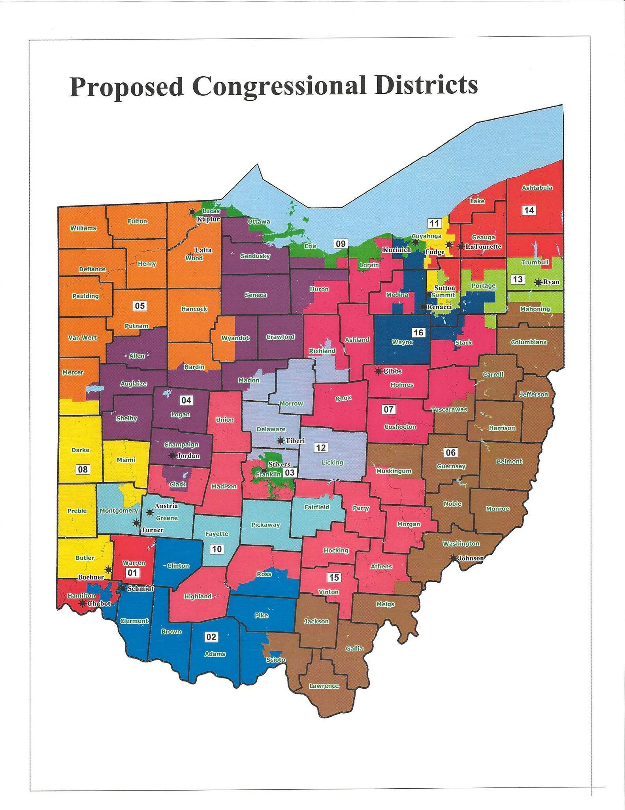
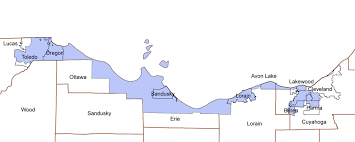

The following analysis predicts congressional elections in Ohio for current districts under the assumption of a 2008 electorate and the condition that voters employ party affiliation as the sole determining factor for who to vote for. The approach is general and could be used to predict any hypothetical district and to check that the theoretical district met congressional requirements for population totals. 

## Preprocessing 2008 electoral results

From the Harvard Election Data Archive <https://dataverse.harvard.edu/dataset.xhtml?persistentId=hdl:1902.1/21919>, I obtained precinct level election results for 2008. Each precinct had the longitude and latitude for the barycenter of the district as well as recorded vote totals for the Democratic and Republican house candidate in that district. I further augmented the data by estimating the population of each precinct by multiplying the total vote in each precinct by the reciprocal of the voter turn out rate in the county.
```{r}
library(dplyr)
pastRes<-read.csv("oh_vote_merged_final.csv")
pop<-read.csv("pop.csv")
voteWpop<-merge(pop,pastRes,by.x="County",by.y="COUNTY_NAME")
z<-group_by(voteWpop,County)
f<-data.frame(summarize(z,sum(ush_tvote_08)))
final0<-merge(voteWpop,f)
final<-mutate(final0, pripop=as.integer(ush_tvote_08*(as.numeric(as.character(Total.Population)))/sum.ush_tvote_08.))
fin<-final[,c("INTPTLAT10","INTPTLON10","ush_dvote_08","ush_rvote_08","pripop")]
```
 Additionally, A close inspection of the data demonstrated that the latitude and longitude data and vote counts for Van Wert county were missing. We removed the offending precincts and added one data point for the entire county. This should not be a problem as Van Wert's small population size and  position on the boarder of Ohio makes it unlikely for hypothetical precincts to partition Van Wert
```{r}
fin[11069,]=c(40.8712, -84.5641,5046,8993,28744)
fin<-fin[!is.na(fin[,1]),]
```

## Verbal description of the algorithm

The approach will be relatively simple. Give a hypothetical district we will obtain a Democratic vote total, Republican vote total, and population total as follows. For each precinct we will check if the coordinates for the barycenter fall within the district or not. If the point is in the district we will add the Democratic vote, Republican vote, and population of that precinct to the respective running total. After performing this process for each of the over 10,000 precincts we arrive at the estimates for the precinct.

The most difficult part of the algorithm will be determining when a point is in a district or not. Districts often constitute polygons with over 1,000 vertices and hence are quite complicate and irregular objects. Thus determining membership of a point in a district presents a small challenge. 

To overcome this challenge, we first triangulate each polygonal district. In other words we decompose the complicated polygon, which is the district into a large number of triangles.  Triangles and convex shapes more generally have regularity to their geometry. Specifically the interior of convex shape is the intersection of half planes formed by the edges. Thus determining membership of a point in a convex shape reduces to determining membership in a half plane, which can be performed by elementary geometry. 

Since all the triangles in our triangulation form our district, it suffices to find Democratic vote, Republican vote, and population totals for each triangle and then sum over all of the triangles. 

## An explicit look at the algorithm

As indicated above our first goal will be to create an algorithm to triangulate a district.  To do this we need some basic geometry tools. We need to be able to measure angles.  The following function takes three points x1, x2, and x3, and measures the angle between the vector from x2 to x1 and the vector from x2 to x3 in a counter-clockwise direction. Note that the returned angle is given in units radians/pi. Thus a right angle is 0.5 and all angles take values between 0 and 2. 
```{r}
ang<-function(x1,x2,x3){
      v1<-c(x1[1]-x2[1],x1[2]-x2[2]) # The vector from x2 to x1
      v2<-c(x3[1]-x2[1],x3[2]-x2[2]) # The vector from x2 to x3
      perk<-c(x3[2]-x1[2],-x3[1]+x1[1]) 
      #A vector perpendicular to the line from x1 to x3.
      #This is used to make sure we go counter clockwise
      dot1<-v1[1]*v2[1]+v1[2]*v2[2] # The dot product of v1 and v2
      dot2<-v1[1]*perk[1]+v1[2]*perk[2] 
      magv1<-sqrt(v1[1]^2+v1[2]^2) # magnitude of v1
      magv2<-sqrt(v2[1]^2+v2[2]^2) # magnitude of v2
      a<-acos(pmin(pmax(dot1/(magv1*magv2),-1.0),1.0))/pi #by law of cosin
      if(dot2<0){ 
            a<-2-a
      }
      a
}
```
Observe the following simple right angle calculations that ang perfoms as claimed.
```{r}
ang(c(0,0),c(0,1),c(1,1))
ang(c(0,0),c(1,0),c(1,1))
```


We require the following preprocessing functions for our district. The first, deldup, deletes repeated vertices in polygons. The second, preproc, takes a polygon as an input and returns a polygon such that the vertices are listed in a clockwise order. 

```{r}
deldup<-function(x){
      y<-x[1,]
      len<-length(x[,1])
      j<-1
      for(i in 2:len){
            if(x[i-1,1]==x[i,1] && x[i-1,2]==x[i,2]){}else{y<-rbind(y,x[i,])}
      }
      y
}
preproc<-function(x){
      x<-deldup(x)
      len<-length(x[,1])
      inang<-ang(x[len-1,],x[1,],x[2,])
      for(index in 1:(len-2)){
            inang<-inang+ang(x[index,],x[index+1,],x[index+2,])
      }
      outang<-ang(x[2,],x[1,],x[len-1,])
      for(index in 3:(len)){
            outang<-outang+ang(x[index,],x[index-1,],x[index-2,])
      }
      if(inang>outang){
            x<-cbind(rev(x[,1]),rev(x[,2]))
      }
      x
}
```
Next we have two functions tript and convpt which determine if a point lies in a given triangle or convex shape respectfully. Note that the stipulation that the function ang measure the angle counter clockwise allows us to check if the point is in each half plane formed by the edges.

```{r}
tript<-function(t,pt){
      c=1
      if(ang(pt,t[1,],t[2,])>1){c=0}
      if(ang(pt,t[2,],t[3,])>1){c=0}
      if(ang(pt,t[3,],t[1,])>1){c=0}
      c
}
convpt<-function(t,pt){
      c<-1
      k<-length(t[,1])
      for(i in 1:(k-1)){
            if(ang(pt,t[i,],t[i+1,])>1){c<-0}
      }
      c
}
```
As demonstration observe that the point (1,0) is not in the triangle formed by the points (0,0), (0,3), and (3,3), but point (1,2) is in the triangl. Thus 
```{r}
triangle<-t(matrix(c(0,0,0,3,3,3),2,3))
triangle
pt1<-c(1,0);pt2<-c(1,2)
tript(triangle, pt1)
tript(triangle, pt2)
```

We are now ready to show you the triangulation function called tri. The function relies on the fact that every polygon can be decomposed into a triangle and a second polygon with strictly fewer edges. We identify the triangle by testing sets of three consecutive points in the polygon as test triangles. For a triangle to form a proper decomposition, it must satisfy two criteria. 

First the triangle formed by the three points must fall within the polygon.
If the ang function of these three points is larger than 1 (note that the ang function gives the angle in the unit radians/pi), then the triangle formed by these three points is outside of the polygon and if the angle is less than one, then it falls into the triangle. Thus ang of these three points must be less than 1 for the test triangle to yield the desired decomposition. 

Second the triangle formed by these three points must not intersect any other edges, or equivalently, the triangle must not contain any other points of the polygon. 

The algorithm takes a polygon and decomposes it into a triangle and a polygon with a strictly smaller number of sides. It adds the triangle to a list of triangles and then decomposes the new smaller polygon into a triangle and an even smaller polygon. Thus by iterating this process the function tri produces a complete triangulation of the given polygon.
```{r}
tri<-function(x){
      x<-preproc(x)
      y<-list()
      i<-0
      while(length(x[,1])>4){
            i<-i+1
            k<-length(x[,1])
            v1<-rep(1,k)
            v1[1]=0
            v2<-rep(0,k)
            v2[1]=1;v2[2]=1;v2[3]=1;v2[k]=1
            v3<-rep(1,k)
            v3[2]=0
            while(length(x[,1])==k){
                  t<-1
                  z<-subset(x, as.logical(v2))
                  if(ang(x[1,],x[2,],x[3,])>=1){t<-0}
                  for(ind in 4:(k-1)){
                        if(tript(z,x[ind,])==1){t<-0}
                  }      
                  if(t==1){
                        y[[i]]<-z
                        x<-subset(x, as.logical(v3))
                  } else{
                        x<-rbind(subset(x, as.logical(v1)),x[2,])
                  }
            }
      }
      i<-i+1
      y[[i]]<-x
      y
}
```
To demonstrate tri, we introduce the package USAboundaries. USAboundaries contains boundaries for states, counties, and congressional districts over American history. The following code extracts a polygon representing the 3rd district of Ohio (Portions of Columbus) and triangulates it. 
```{r}
library(USAboundaries)
ohiodist<-us_boundaries(type="congressional",resolution="low",state="Ohio")
OH3<-ohiodist@polygons[[1]]@Polygons[[1]]@coords
triOH3<-tri(OH3)
plot(OH3,type="n", xlab= "longitude", ylab= "latitude")
for(i in 1:length(triOH3)){lines(triOH3[[i]])}
```


Now, we are almost ready to reveal the function, which actually sums district results, but first let us look at one additional function which while theoretically unnecessary, allows the code to run faster. The following two functions take a polygon and return its convex hull (A convex hull of a geometric object is the smallest convex shape which includes the original object)
```{r}
angtest<-function(x){
      k<-length(x[,1])
      v<-rep(0,k-1)
      if(ang(x[k-1,],x[1,],x[2,])<1){v[1]=1}
      for(index in  2:(k-1)){
            if(ang(x[index-1,],x[index,],x[index+1,])<1){v[index]=1
            }
      }
      t=k-1-sum(v)
      list(v,t)
}
hull<-function(x){
      x<-preproc(x)
      while(angtest(x)[[2]]>0){
            x<-subset(x,as.logical(angtest(x)[[1]]))
      }
      x
      
}
```
Observe how the function hull takes the third district and returns its convex hull. The green region is the original district and the purple and green regions together are the convex hull of the district. 
```{r}
hullOH3<-hull(OH3)
plot(OH3,type="n", xlab= "longitude", ylab= "latitude")
polygon(hullOH3,col="purple")
polygon(OH3, col="green")
```
As it is a quick check to determine if a point is in a convex shape, we first will check that a precinct lies within the convex hull of the district before checking if the point is in any of the triangles in the triangulation of the district.

Finally the sum_alldist function takes a list of polygons with lat/lon coordinates in Ohio and counts how many people voted for Republican house candidates and Democratic house candidates within that district and provides an estimate of the population in that district. Note that all needed variables were assigned in the data processing section.
```{r}
sum_alldist<-function(x){
      y<-list()
      for(i in 1:length(x)){y[[i]]<-tri(x[[i]])}
      J2<-length(y)
      lat<-fin[,1]
      lon<-fin[,2]
      res<-matrix(rep(0,3*J2),J2,3)
      hulldist<-list()
      for(i in 1:length(x)){hulldist[[i]]<-hull(x[[i]])}
      for(index in 1:J2){
            J22<-length(y[[index]])
            j<-length(fin[,1])
            for(i in 1:j){
                  if(is.na(lon[i])==1){}
                  else if(is.na(lat[i])==1){}
                  else if(convpt(hulldist[[index]],c(lon[i],lat[i]))==0){}
                  else{
                        pt<-c(lon[i],lat[i])
                        for(I2 in 1:J22){
                              if(tript(y[[index]][[I2]],pt)==1){
                                    res[index,3]<-res[index,3]+fin$pripop[i]
                                    if(is.na(fin$ush_dvote_08[i])){
                                    } else{
                                          res[index,1]<-res[index,1]+fin$ush_dvote_08[i]
                                    }
                                    if(is.na(fin$ush_rvote_08[i])){
                                    } else{
                                          res[index,2]<-res[index,2]+fin$ush_rvote_08[i]
                                    }
     
                              }
                              
                        }
                  }      
   
            }
            
            
      }
      
      res
      
}
```
## Actual Analysis

We are now ready to take this function and apply it to the districts given by USABoundaries. Let's take a quick look at these districts.

```{r}
f<-ohiodist@polygons[[1]]@Polygons[[1]]@coords
 for(i in 2:16){f<-rbind(f,ohiodist@polygons[[i]]@Polygons[[1]]@coords)}
plot(f,type="n", xlab= "longitude", ylab= "latitude")
for(i in 1:16){lines(ohiodist@polygons[[i]]@Polygons[[1]]@coords)}
polygon(ohiodist@polygons[[4]]@Polygons[[1]]@coords, col="red")
```

It looks pretty good right. A quick comparison with the following congresional map shows that USABoundaries did a pretty good job recording the boundaries of Ohio's congressional districts.



However, there is an issue with USABoundaries drawing of district 9. District 9 streatches along the shore of Lake Erie from Cleveland to Toledo. 



We have marked USABoundaries conception of district 9 in red above. As you can see, it only includes the portion of district 9 in Cleveland. 

In order to resolve this obvious defect we sketched out a new district as follows. Using the lon/lat finder at <http://itouchmap.com/latlong.html> we calculated an upper boundary of the district and entered it into R.
```{r}
dist4fix0<-c(-83.409576,41.733645,-83.078613,41.613630,-82.915192,41.523214,-82.836914,41.728761,-82.665253,41.632108,-82.663879,41.486431,-82.496338,41.389415,-82.353516,41.449144,-82.004700,41.532467,-81.822500,41.495260)
dist4fix<-t(matrix(dist4fix0,2,10))
```
Then after studying the polygons defined for the districts bordering district 9 we derived the following boundary.
```{r}
dist4fix<-rbind(dist4fix[1:9,],ohiodist@polygons[[4]]@Polygons[[1]]@coords[2:8,])
dist4fix<-rbind(dist4fix,ohiodist@polygons[[3]]@Polygons[[1]]@coords[15:14,])
dist4fix<-rbind(dist4fix,ohiodist@polygons[[15]]@Polygons[[1]]@coords[12:9,])
dist4fix<-rbind(dist4fix,ohiodist@polygons[[13]]@Polygons[[1]]@coords[36:27,])
dist4fix<-rbind(dist4fix,ohiodist@polygons[[2]]@Polygons[[1]]@coords[16:9,])
dist4fix<-rbind(dist4fix,c(-83.40958,41.73365))
```
We then enter this in place of the USABoundaries district. Observe how the new map improves the representation of district 9. Note that we have exaggerated the boundary to include some of lake Erie, but this should have no effect as no precincts are in the lake.
```{r}
dist<-list()
for(i in 1:16){dist[[i]]=ohiodist@polygons[[i]]@Polygons[[1]]@coords}
dist[[4]]=dist4fix
plot(f,type="n", xlab= "longitude", ylab= "latitude")
for(i in 1:16){lines(dist[[i]])}
```
With this issue resolved, we apply the algorithm above to these districts
```{r}
res<-sum_alldist(dist)
res
```
## Analysis of results
To better understand the outcome of the analysis first we will map the results by color and then we will perform bootstrap resampling to determine confidence intervals for these results. 

For the plot we red/blue diverging color spectrum in R. Darker colors of blue indicate races that Democrats are more likely to win and darker colors of red indicate races Republicans are more likely to win.
```{r}
library(RColorBrewer)
cols<-brewer.pal(11,"RdBu")
pals<-colorRampPalette(cols)
pals2<-pals(60)
c<-as.integer(res[,1]/(res[,1]+res[,2])*100)
plot(f,type="n", xlab= "longitude", ylab= "latitude")
for(i in 1:16){polygon(dist[[i]],col=pals2[c[i]-20])}
```