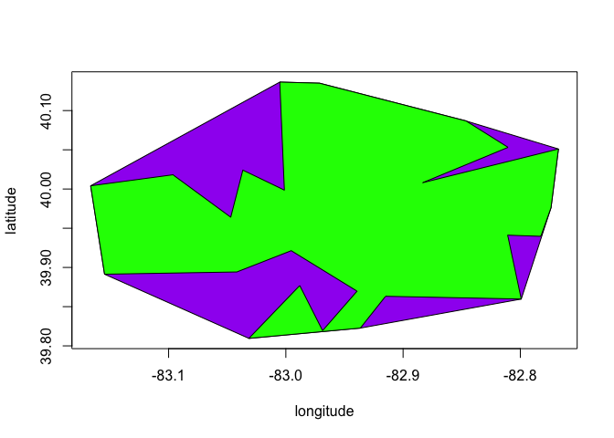
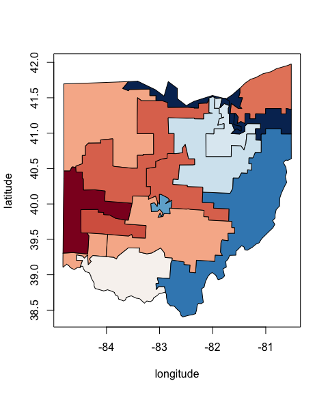

The following analysis predicts congressional elections in Ohio for
curent districts under the assumption of a 2008 electorate and the
condition that voters employ party affiliation as the sole determining
factor for who to vote for. The approach is gerneral and could be used
to predict any hypothetical district and to check that the theoretical
district met congresional requirements for population totals.

Preprocessing 2008 electoral results
------------------------------------

From the Harvard Election Data Archive
<https://dataverse.harvard.edu/dataset.xhtml?persistentId=hdl:1902.1/21919>,
I obtained precinct level election results for 2008. Each pricint had
the longitude and latitude for the barycenter of the district as well as
recorded vote totals for the Democratic and Republican house candidate
in that district. I further augmented the data by estimating the
population of each pricinct by multiplying the total vote in each
pricinct by the reciprocol of the voter turn out rate in the county.

    library(dplyr)

    ## 
    ## Attaching package: 'dplyr'

    ## The following objects are masked from 'package:stats':
    ## 
    ##     filter, lag

    ## The following objects are masked from 'package:base':
    ## 
    ##     intersect, setdiff, setequal, union

    pastRes<-read.csv("oh_vote_merged_final.csv")
    pop<-read.csv("pop.csv")
    voteWpop<-merge(pop,pastRes,by.x="County",by.y="COUNTY_NAME")
    z<-group_by(voteWpop,County)
    f<-data.frame(summarize(z,sum(ush_tvote_08)))
    final0<-merge(voteWpop,f)
    final<-mutate(final0, pripop=as.integer(ush_tvote_08*(as.numeric(as.character(Total.Population)))/sum.ush_tvote_08.))
    fin<-final[,c("INTPTLAT10","INTPTLON10","ush_dvote_08","ush_rvote_08","pripop")]

Additionally, A close inspection of the data demonstrated that the
latatude and longitude data and vote counts for Van Wert county were
missing. We removed the offending precincts and added one data point for
the entire county. This should not be a problem as Van Wert's small
population size and position on the boarder of Ohio makes it unlikely
for hypothetical pricincts to partition Van Wert

    fin[11069,]=c(40.8712, -84.5641,5046,8993,28744)
    fin<-fin[!is.na(fin[,1]),]

Verbal description of the algorithm
-----------------------------------

The approach will be relatively simple. Give a hypothetical district we
will obtain a Democratic vote total, Republican vote total, and
population total as follows. For each pricinct we will check if the
coordinates for the barycenter fall within the district or not. If the
point is in the district we will add the Democratic vote, Republican
vote, and population of that precinct to the respective running total.
After performing this process for each of the over 10,000 precincts we
arive at the estimates for the precinct.

The most dificult part of the algorithm will be determining when a point
is in a district or not. Districts often constitute polygons with over
1,000 vertices and hence are quite complicate and irregular objects.
Thus determining membership of a point in a district presents a small
challenge.

To overcome this challenge, we first triangulate each polygonal
district. In otherwords we decompose the complicated polygon which is
the district into a large number of triangles. Triangles and convex
shapes more generally have a regularity to their geometry. Specifically
the interior of convex shape is the intersection of half planes formed
by the edges. Thus determining membership of a point in a convex shape
reduces to determining membership in a half plane which can be performed
by elementary geometry.

Since all the triangles in our triangulation form our district, it
suffices to find Democratic vote, Republicant vote, and population
totals for each triangle and then sum over all of the triangles.

An explicit look at the algorithm
---------------------------------

As indicated above our first goal will be to create an algorithm to
triangulate a district. To do this we need some basic geometry tools,
the first being angle measurement. The following function takes three
points x1, x2, and x3, and measures the angle between the vector from x2
to x1 and the vector from x2 to x3 in a counter-clockwise direction.
Note that the returned angle is given in units radians/pi. Thus a right
angle is 0.5 and all angles take values between 0 and 2.

    ang<-function(x1,x2,x3){
          v1<-c(x1[1]-x2[1],x1[2]-x2[2]) # The vector from x2 to x1
          v2<-c(x3[1]-x2[1],x3[2]-x2[2]) # The vector from x2 to x3
          perk<-c(x3[2]-x1[2],-x3[1]+x1[1]) 
          #A vector perpendicular to the line from x1 to x3.
          #This is used to make sure we go counter clockwise
          dot1<-v1[1]*v2[1]+v1[2]*v2[2] # The dot product of v1 and v2
          dot2<-v1[1]*perk[1]+v1[2]*perk[2] 
          magv1<-sqrt(v1[1]^2+v1[2]^2) # magnitude of v1
          magv2<-sqrt(v2[1]^2+v2[2]^2) # magnitude of v2
          a<-acos(pmin(pmax(dot1/(magv1*magv2),-1.0),1.0))/pi #by law of cosin
          if(dot2<0){ 
                a<-2-a
          }
          a
    }

Observe the following simple right angle calculations that ang perfoms
as claimed.

    ang(c(0,0),c(0,1),c(1,1))

    ## [1] 0.5

    ang(c(0,0),c(1,0),c(1,1))

    ## [1] 1.5

We require the following preprocessing functions for our district. The
first, deldup, deletes repeated verticies in polygons. The second,
preproc, takes a polygon as an input and returns a polygon such that the
vertices are listed in a clockwise order.

    deldup<-function(x){
          y<-x[1,]
          len<-length(x[,1])
          j<-1
          for(i in 2:len){
                if(x[i-1,1]==x[i,1] && x[i-1,2]==x[i,2]){}else{y<-rbind(y,x[i,])}
          }
          y
    }
    preproc<-function(x){
          x<-deldup(x)
          len<-length(x[,1])
          inang<-ang(x[len-1,],x[1,],x[2,])
          for(index in 1:(len-2)){
                inang<-inang+ang(x[index,],x[index+1,],x[index+2,])
          }
          outang<-ang(x[2,],x[1,],x[len-1,])
          for(index in 3:(len)){
                outang<-outang+ang(x[index,],x[index-1,],x[index-2,])
          }
          if(inang>outang){
                x<-cbind(rev(x[,1]),rev(x[,2]))
          }
          x
    }

Next we have two functions tript and convpt which determine if a point
lies in a given triangle or convex shape respectfully. Note that the
stipulation that the function ang measure the angle counter clocwise
allows us to check if the point is in each half plane formed by the
edges.

    tript<-function(t,pt){
          c=1
          if(ang(pt,t[1,],t[2,])>1){c=0}
          if(ang(pt,t[2,],t[3,])>1){c=0}
          if(ang(pt,t[3,],t[1,])>1){c=0}
          c
    }
    convpt<-function(t,pt){
          c<-1
          k<-length(t[,1])
          for(i in 1:(k-1)){
                if(ang(pt,t[i,],t[i+1,])>1){c<-0}
          }
          c
    }

As demonstration observe that the point (1,0) is not in the triangle
formed by the points (0,0), (0,3), and (3,3), but point (1,2) is in the
triangl. Thus

    triangle<-t(matrix(c(0,0,0,3,3,3),2,3))
    triangle

    ##      [,1] [,2]
    ## [1,]    0    0
    ## [2,]    0    3
    ## [3,]    3    3

    pt1<-c(1,0);pt2<-c(1,2)
    tript(triangle, pt1)

    ## [1] 0

    tript(triangle, pt2)

    ## [1] 1

We are now ready to show you the triangulation function called tri. The
function relys on the fact that every polygon can be decomposed into a
triangle and a second polygon with strictly fewer edges. We identify the
triangle by testing sets of three consecutive points in the polygon as
test triangles. For a triangle to form a proper decomposition, it must
satisfy two criteria.

First the triangle formed by the three points must fall within the
polygon. If the ang function of these three points is larger than 1
(note that the ang function gives the angle in the unit radians/pi),
then the triangle formed by these three points is outside of the polygon
and if the angle is less than one, then it falls into the triangle. Thus
ang of these three points must be less than 1 for the test triangle to
yield the desired decomposition.

Second the triangle formed by these three points must not intersect any
other edges, or equivalently, the triangle must not contain any other
points of the polygon.

The algorithm takes a polygon and decomposes it into a triangle and a
polygon with a strictly smaller numer of sides. It adds the triangle to
a list of triangles and the decomposes the new smaller polygon into a
triangle and an even smaller polygon. Thus by itterating this process
the function tri produces a complete triangulation of the given polygon.

    tri<-function(x){
          x<-preproc(x)
          y<-list()
          i<-0
          while(length(x[,1])>4){
                i<-i+1
                k<-length(x[,1])
                v1<-rep(1,k)
                v1[1]=0
                v2<-rep(0,k)
                v2[1]=1;v2[2]=1;v2[3]=1;v2[k]=1
                v3<-rep(1,k)
                v3[2]=0
                while(length(x[,1])==k){
                      t<-1
                      z<-subset(x, as.logical(v2))
                      if(ang(x[1,],x[2,],x[3,])>=1){t<-0}
                      for(ind in 4:(k-1)){
                            if(tript(z,x[ind,])==1){t<-0}
                      }      
                      if(t==1){
                            y[[i]]<-z
                            x<-subset(x, as.logical(v3))
                      } else{
                            x<-rbind(subset(x, as.logical(v1)),x[2,])
                      }
                }
          }
          i<-i+1
          y[[i]]<-x
          y
    }

To demonstrate tri, we introduce the package USAboundaries.
USAboundaries contains boundaries for states, counties, and congresional
districts over american history. The following code extracts a polygon
representing the 3rd district of Ohio (Portions of Columbus) and
triangulates it.

    library(USAboundaries)
    ohiodist<-us_boundaries(type="congressional",resolution="low",state="Ohio")
    OH3<-ohiodist@polygons[[1]]@Polygons[[1]]@coords
    triOH3<-tri(OH3)
    plot(OH3,type="n", xlab= "longitude", ylab= "latitude")
    for(i in 1:length(triOH3)){lines(triOH3[[i]])}

Now, we are almost ready to reveal the function which actually sums
district results, but first let us look at one additional function which
while theoretically unecessary, allows the code to run faster. The
following two functions take a polygon and return its convex hull (A
convex hull of a geometric object is the smallest convex shape which
includes the original object)

    angtest<-function(x){
          k<-length(x[,1])
          v<-rep(0,k-1)
          if(ang(x[k-1,],x[1,],x[2,])<1){v[1]=1}
          for(index in  2:(k-1)){
                if(ang(x[index-1,],x[index,],x[index+1,])<1){v[index]=1
                }
          }
          t=k-1-sum(v)
          list(v,t)
    }
    hull<-function(x){
          x<-preproc(x)
          while(angtest(x)[[2]]>0){
                x<-subset(x,as.logical(angtest(x)[[1]]))
          }
          x
          
    }

Observe how the function hull takes the third distric an returns its
convex hull. The green region is the original district and the purple
and green together are the convex hull of the district.

    hullOH3<-hull(OH3)
    plot(OH3,type="n", xlab= "longitude", ylab= "latitude")
    polygon(hullOH3,col="purple")
    polygon(OH3, col="green")

 As it is
a quick check to determine if a point is in a convex shape, we first
will check that a precint lies within the convex hull of the district
before checking if the point is in any of the triangles in the
triangulation of the district.

Finally the sum\_alldist function takes a list of polygons with lat/lon
coordinates in Ohio and counts how many people voted for Republican
house candidates and Democratic house canidates within that district and
provides an estimate of the population in that district. Note that all
needed variables were assigned in the data processing section.

    sum_alldist<-function(x){
          y<-list()
          for(i in 1:length(x)){y[[i]]<-tri(x[[i]])}
          J2<-length(y)
          lat<-fin[,1]
          lon<-fin[,2]
          res<-matrix(rep(0,3*J2),J2,3)
          hulldist<-list()
          for(i in 1:length(x)){hulldist[[i]]<-hull(x[[i]])}
          for(index in 1:J2){
                J22<-length(y[[index]])
                j<-length(fin[,1])
                for(i in 1:j){
                      if(is.na(lon[i])==1){}
                      else if(is.na(lat[i])==1){}
                      else if(convpt(hulldist[[index]],c(lon[i],lat[i]))==0){}
                      else{
                            pt<-c(lon[i],lat[i])
                            for(I2 in 1:J22){
                                  if(tript(y[[index]][[I2]],pt)==1){
                                        res[index,3]<-res[index,3]+fin$pripop[i]
                                        if(is.na(fin$ush_dvote_08[i])){
                                        } else{
                                              res[index,1]<-res[index,1]+fin$ush_dvote_08[i]
                                        }
                                        if(is.na(fin$ush_rvote_08[i])){
                                        } else{
                                              res[index,2]<-res[index,2]+fin$ush_rvote_08[i]
                                        }
         
                                  }
                                  
                            }
                      }      
       
                }
                
                
          }
          
          res
          
    }

Actual Analysis
---------------

We are now ready to take this function and apply it to the districts
given by USABoundaries. Let's take a quick look at these districts.

    f<-ohiodist@polygons[[1]]@Polygons[[1]]@coords
     for(i in 2:16){f<-rbind(f,ohiodist@polygons[[i]]@Polygons[[1]]@coords)}
    plot(f,type="n", xlab= "longitude", ylab= "latitude")
    for(i in 1:16){lines(ohiodist@polygons[[i]]@Polygons[[1]]@coords)}
    polygon(ohiodist@polygons[[4]]@Polygons[[1]]@coords, col="red")

Looks pretty good right. A quick comparison with the shows that
USABoundaries did a pretty good job recording the boundaries of Ohio's
congressional districts.

However, there is an issue with USABoundaries drawing of district 9.
District 9 streatches along the shore of Lake Erie from Cleveland to
Toledo.

We have marked USABoundaries conception of district 9 in red above. As
you can see, it only includes the portion of district 9 in Cleveland.

In order to resolve this obvious defect we sketched out a new district
as follows. Using the lon/lat finder at
<http://itouchmap.com/latlong.html> we calculated an upper boundary of
the district and entered it into R.

    dist4fix0<-c(-83.409576,41.733645,-83.078613,41.613630,-82.915192,41.523214,-82.836914,41.728761,-82.665253,41.632108,-82.663879,41.486431,-82.496338,41.389415,-82.353516,41.449144,-82.004700,41.532467,-81.822500,41.495260)
    dist4fix<-t(matrix(dist4fix0,2,10))

Then after studying the polygons defined for the districts bordering
district 9 we derived the following boundary.

    dist4fix<-rbind(dist4fix[1:9,],ohiodist@polygons[[4]]@Polygons[[1]]@coords[2:8,])
    dist4fix<-rbind(dist4fix,ohiodist@polygons[[3]]@Polygons[[1]]@coords[15:14,])
    dist4fix<-rbind(dist4fix,ohiodist@polygons[[15]]@Polygons[[1]]@coords[12:9,])
    dist4fix<-rbind(dist4fix,ohiodist@polygons[[13]]@Polygons[[1]]@coords[36:27,])
    dist4fix<-rbind(dist4fix,ohiodist@polygons[[2]]@Polygons[[1]]@coords[16:9,])
    dist4fix<-rbind(dist4fix,c(-83.40958,41.73365))

We then enter this in place of the USABoundaries district. Observe how
the new map improves the representation of district 9. Note that we have
exagerated the boundary to include some of lake Erie, but this should
have no effect as no precincts are in the lake.

    dist<-list()
    for(i in 1:16){dist[[i]]=ohiodist@polygons[[i]]@Polygons[[1]]@coords}
    dist[[4]]=dist4fix
    plot(f,type="n", xlab= "longitude", ylab= "latitude")
    for(i in 1:16){lines(dist[[i]])}

 With this
issue resolved, we apply the algorithm above to these districts

    res<-sum_alldist(dist)
    res

    ##         [,1]   [,2]   [,3]
    ##  [1,] 179470 118122 717630
    ##  [2,] 153214 194520 730509
    ##  [3,] 205554 181334 837518
    ##  [4,] 214045  66668 595185
    ##  [5,] 131106 194651 731908
    ##  [6,] 138092 213217 722363
    ##  [7,] 144722 201914 739043
    ##  [8,] 145166 177896 673877
    ##  [9,] 109928 222937 724681
    ## [10,] 252102  76272 679116
    ## [11,] 266703  55451 684573
    ## [12,] 153941 152374 747596
    ## [13,] 127891 189106 697723
    ## [14,] 184643 108069 676503
    ## [15,] 177815 146020 726594
    ## [16,] 134558 168819 738209

Analysis of results
-------------------

To better understand the outcome of the analysis first we will map the
results by color and then we will perform bootstrap resampling to
determin confidence intervals for these results.

For the plot we red/blue diverging color spectrum in R. Darker colors of
blue indicate races that Democrats are more likelye to win and darker
colors of red indicate races Republicans are more likely to win.

    library(RColorBrewer)
    cols<-brewer.pal(11,"RdBu")
    pals<-colorRampPalette(cols)
    pals2<-pals(60)
    c<-as.integer(res[,1]/(res[,1]+res[,2])*100)
    plot(f,type="n", xlab= "longitude", ylab= "latitude")
    for(i in 1:16){polygon(dist[[i]],col=pals2[c[i]-20])}

